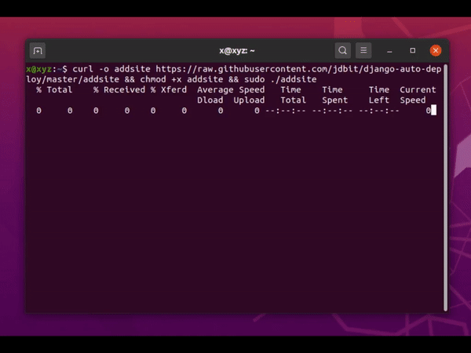

# Deploy as many Django websites as you want with one simple command

This script allows you to set up multiple Django websites easily. It automatically installs all the necessary dependencies (Nginx, Gunicorn, MySQL/MariaDB/PostgreSQL, and Django database connector) on your Ubuntu server, prepares a python virtual environment, and configure the selected database. Just by typing one command in the command line, you get the fully working Django website with a configured database.



## Features and what is this script doing

1. Generate SFTP/database passwords
2. Create a working directory in `/var/www/$SITENAME`
3. Create a new Linux user and add it to the sftp group
4. Assign user permissions to the working directory
5. Install necessary dependencies: nginx, python3-pip, mysql-server/mariadb-server/postgresql, virtualenv, gunicorn, django, mysql-connector-python/psycopg2
6. Create a new Django project, database, and configure Django to work with the MySQL/MariaDB/PostgreSQL database
7. Create NGINX and Gunicorn config files (a separate config file for each site)
8. Create `.gitignore` file
9. Add settings for static and media files
10. Collect static files after installation

## Installation & Usage

Execute this command on your server:

```
curl -o addsite https://raw.githubusercontent.com/jdbit/django-auto-deploy/master/addsite && chmod +x addsite && sudo ./addsite
```

This command will clone the script to the current directory, make it executable, and execute with root privileges.

You just need to select a database engine (MySQL, MariaDB, PostgreSQL, or SQLite), enter the desired website and domain name when requested and your website is ready to use!  If you want to add another website, just run the `sudo ./addsite` again.

All the sites will be placed to `/var/www/{SITENAME}` directory. Before running the script, make sure there is no folder in `/var/www` named as the site you are going to create.

## Installation logs

In the project directory `/var/www/$SITENAME` a log file will be created:

* `deploy.log` - bash script output will be saved to this file, you can check it to ensure there were no errors during the installation process

The script creates Python virtual environment in `/var/www/{SITENAME}/env` directory, you can activate the virtual environment by this command:

```
source env/bin/activate
```
and exit from the python virtual environment with this command in your project directory:
```
deactivate
```

The script creates a new MySQL/MariaDB/PostgreSQL database, a new DB user, and adds the necessary DB settings to DATABASES dict in settings.py.

## Configuration files
The script creates two configuration files for Nginx and Gunicorn:

* Nginx config located at: `/etc/nginx/sites-available/{SITE_NAME}.conf`
* Gunicorn config: `/etc/systemd/system/gunicorn_{SITE_NAME}.service`

If you changed the Nginx config file, don't forget to reload Nginx with `sudo service nginx restart` command. If you changed any files in your Django project, you should reload the Gunicorn service with `sudo systemctl restart gunicorn_YOUR_SITE_NAME` command to aply changes.

## Warning

Use the script on your own risk. It was tested only with fresh Ubuntu 20.04 Server installation. If you run it on your already configured server, there might be conflicts with other software installed.

## Django hosting recommendation

If you need a good and affordable hosting for your Django projects, [I would recommend DigitalOcean](https://m.do.co/c/008d3315ed7b), you can get $100 in credit for 60 days through my referral link. You can run a few simple Django websites on a single virtual server just for 5$/month. I've tested it on the latest Ubuntu Server 20.04 installed on DigitalOcean 6$/month droplet.

You can set up as many Django websites as you want with this script, just keep in mind that every site takes 100-300Mb of RAM on your server. I tested it with 5 sites installed on a [DigitalOcean droplet ($10/per month)](https://m.do.co/c/008d3315ed7b) with 2GB of RAM.
